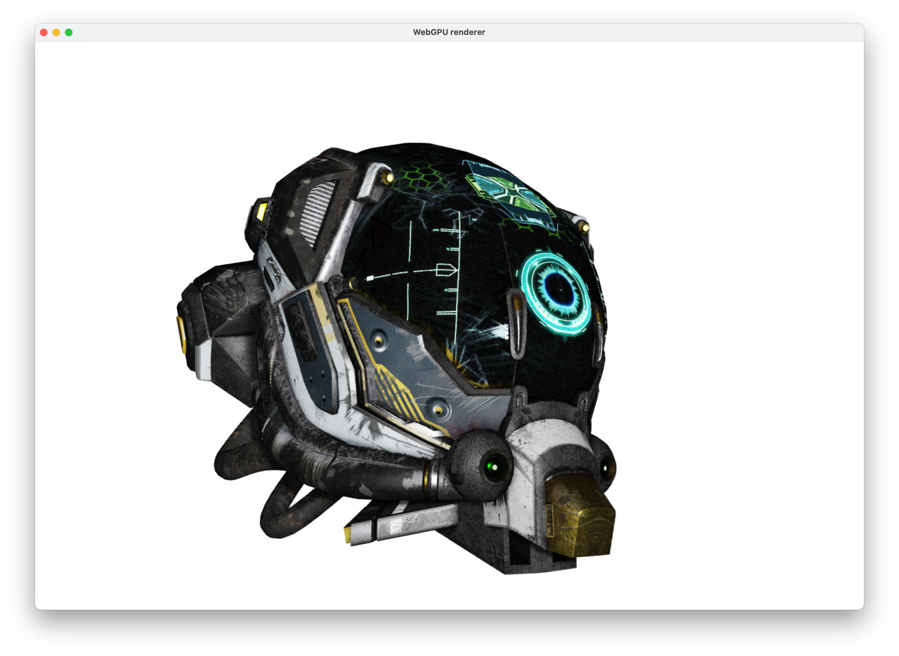

# WebGPU renderer for gltf models

A web renderer for gltf models. Built to experiment and learn webassembly and webgpu. Can be built to webassembly or as a native executable. 

Current status:

- Implemented features
    * MSAA
    * base color texture
    * normal map
    * ambient occlusion map
    * diffuse shading

- Todo
    * PBR shading
    * emissive map
    * shadow map
    * generate mip map levels
    * reflection map
    * HDR
    * webassembly build
